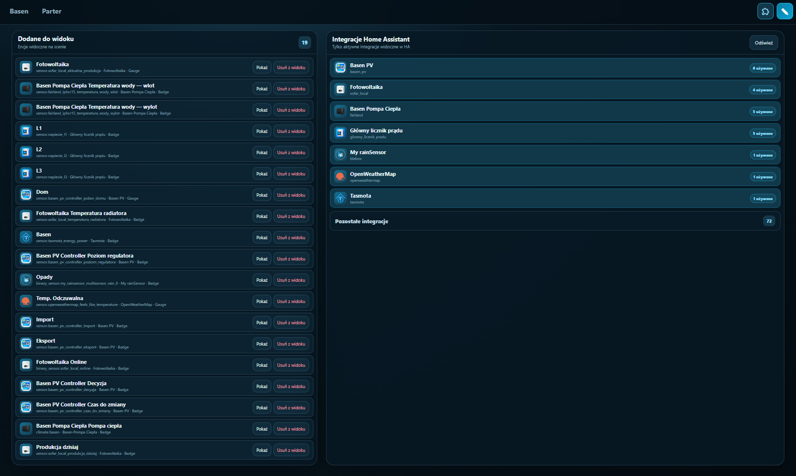
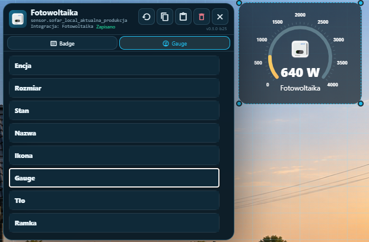

# HA Views

Create polished, interactive visual dashboards for Home Assistant on any image or solid-colour background. One saved layout stays responsive across desktop, laptop and mobile.

## Highlights

- **Independent dashboards** — create, duplicate, rename, reorder and delete views; choose the view that opens by default.
- **Complete background workflow** — use a solid colour or upload PNG, JPG and WebP images; select, download and delete saved backgrounds.
- **Four marker types** — Badge, Gauge, Icon and Horseshoe — each independently positioned and styled.
- **Rich Badge and Icon styling** — labels, values and custom ON/OFF text; Home Assistant icons, custom MDI icons or integration logos; separate fill, outline, colour and opacity settings, including ON/OFF variants.
- **Background and border effects** — solid colour or central, corner, wall and ambient light gradients with position, spread and fill controls; adjustable borders, thickness, opacity and shapes.
- **Advanced Gauge and Horseshoe** — configurable range, track and value colours, gradient, arc geometry, scale, ticks, tick labels, value, name and percentage.
- **Fast visual editing** — drag markers, resize with corner handles, lock geometry, use S/M/L snap grid presets and scale all marker content independently.
- **Safe styling workflow** — reset individual sliders, restore defaults, copy/paste complete styles, and test an ON/OFF state without controlling the entity.
- **Home Assistant actions** — open native More Info or toggle supported entities directly from a marker in view mode.
- **Integration browser** — shows visible Home Assistant integrations only, with brand icons, used-marker counts and search by entity name or `entity_id`.
- **Responsive controls** — desktop mouse-wheel zoom plus mobile pinch, pan and editing that preserves exact marker positions.
- **Built for Home Assistant** — layouts and styling are saved in Home Assistant; HA Views does not publish your entities, integrations or backgrounds.

## Status

Stable release. As with every Home Assistant add-on update, make a backup before updating.

See [Documentation](ha_views/DOCS.md) and [Changelog](ha_views/CHANGELOG.md).

---

# Polski

Twórz dopracowane, interaktywne wizualne pulpity Home Assistanta na dowolnym obrazie lub jednolitym kolorze tła. Jeden zapisany układ działa responsywnie na komputerze, laptopie i telefonie.

## Najważniejsze funkcje

- **Niezależne pulpity** — twórz, duplikuj, zmieniaj nazwę, kolejność i usuwaj widoki; wybierz widok uruchamiany domyślnie.
- **Pełna obsługa tła** — jednolity kolor albo pliki PNG, JPG i WebP; wybór, pobieranie i usuwanie zapisanych teł.
- **Cztery typy markerów** — Badge, Gauge, Ikona i Podkowa — każdy niezależnie pozycjonowany i stylowany.
- **Rozbudowany Badge i Ikona** — nazwa, stan oraz własne teksty ON/OFF; ikony Home Assistant, własne MDI lub logo integracji; osobne wypełnienie, obrys, kolor i przezroczystość, także dla ON/OFF.
- **Efekty tła i ramki** — jednolity kolor albo gradienty: centralny, róg, od ściany i ambient, z pozycją, rozproszeniem i wypełnieniem; regulowane ramki, grubość, przezroczystość i kształty.
- **Zaawansowane Gauge i Podkowa** — zakres, kolory toru i wartości, gradient, geometria łuku, skala, podziałki, liczby skali, stan, nazwa i procent.
- **Szybka edycja wizualna** — przeciąganie markerów, zmiana rozmiaru uchwytami rogów, blokada geometrii, siatka S/M/L i niezależna skala całej zawartości.
- **Bezpieczny styl** — reset pojedynczych suwaków, przywracanie domyślnych, kopiowanie/wklejanie pełnego stylu oraz test stanu ON/OFF bez sterowania encją.
- **Akcje Home Assistant** — natywne More Info albo bezpośrednie przełączanie obsługiwanych encji po kliknięciu markera w widoku.
- **Przeglądarka integracji** — tylko widoczne integracje Home Assistant, ikony marek, liczba użytych markerów i wyszukiwanie po nazwie lub `entity_id`.
- **Responsywne sterowanie** — zoom rolką na komputerze oraz pinch, pan i edycja na telefonie z zachowaniem dokładnych pozycji markerów.
- **Dane pozostają u Ciebie** — układy i style są zapisywane w Home Assistant; HA Views nie publikuje Twoich encji, integracji ani teł.

## Status

Wersja stabilna. Jak przy każdej aktualizacji dodatku Home Assistant, przed aktualizacją wykonaj backup.

Pełna [dokumentacja](ha_views/DOCS.md) i [changelog](ha_views/CHANGELOG.md).
