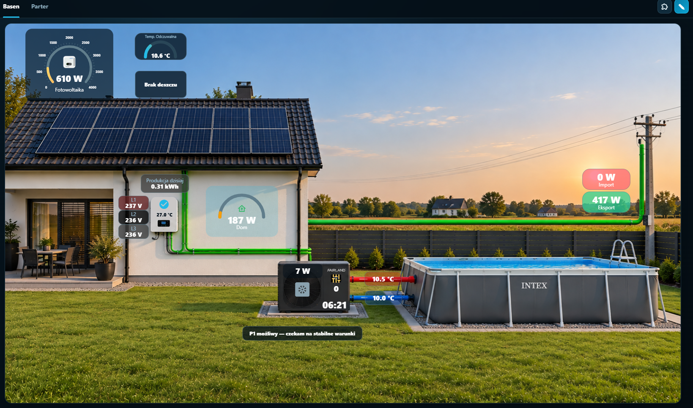

# HA Views

Create polished, interactive visual dashboards for Home Assistant on any background image.

HA Views lets you place Home Assistant entities as fully configurable **Badge** and **Gauge** markers. A single saved layout remains responsive across desktop, laptop and mobile devices.

## Highlights

- multiple independent views with their own backgrounds and markers;
- PNG, JPG and WebP background uploads stored persistently in Home Assistant;
- Badge and Gauge markers with rich visual customisation;
- gauge ranges, gradients, angles, ticks and tick labels;
- Home Assistant and custom MDI icons;
- drag, resize, snap-to-grid and one-to-one style copy/paste;
- direct Home Assistant More Info on marker click outside edit mode;
- integration browser with brand icons and usage counts;
- responsive layouts, desktop mouse-wheel zoom and mobile pinch/pan;
- automatic local persistence of layouts and styling.

## Status

This is an experimental public beta. Make a Home Assistant backup before updating.

See [Documentation](ha_views/DOCS.md) and [Changelog](ha_views/CHANGELOG.md).

---

# Polski

Twórz dopracowane, interaktywne wizualne pulpity Home Assistanta na dowolnym obrazie tła.

HA Views pozwala umieszczać encje Home Assistanta jako w pełni konfigurowalne markery **Badge** i **Gauge**. Jeden zapisany układ działa responsywnie na komputerze, laptopie i telefonie.

## Najważniejsze funkcje

- wiele niezależnych widoków — każdy z własnym tłem i markerami;
- wgrywanie teł PNG, JPG i WebP, trwale zapisywanych w Home Assistant;
- markery Badge i Gauge z rozbudowaną personalizacją;
- zakresy, gradienty, kąty, podziałki i liczby skali Gauge;
- ikony Home Assistant i własne ikony MDI;
- przesuwanie, skalowanie, snap-to-grid oraz kopiowanie stylu 1:1;
- natywne Home Assistant More Info po kliknięciu markera poza edycją;
- przeglądarka integracji z ikonami marek i liczbą użytych encji;
- responsywny układ, zoom rolką na komputerze oraz pinch/pan na telefonie;
- automatyczny lokalny zapis układu i stylów.

## Status

To eksperymentalna publiczna beta. Przed aktualizacją wykonaj backup Home Assistanta.

Pełna [dokumentacja](ha_views/DOCS.md) i [changelog](ha_views/CHANGELOG.md).
