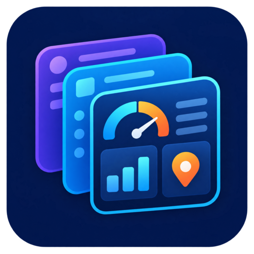
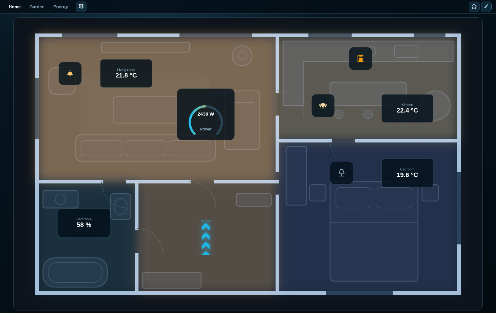
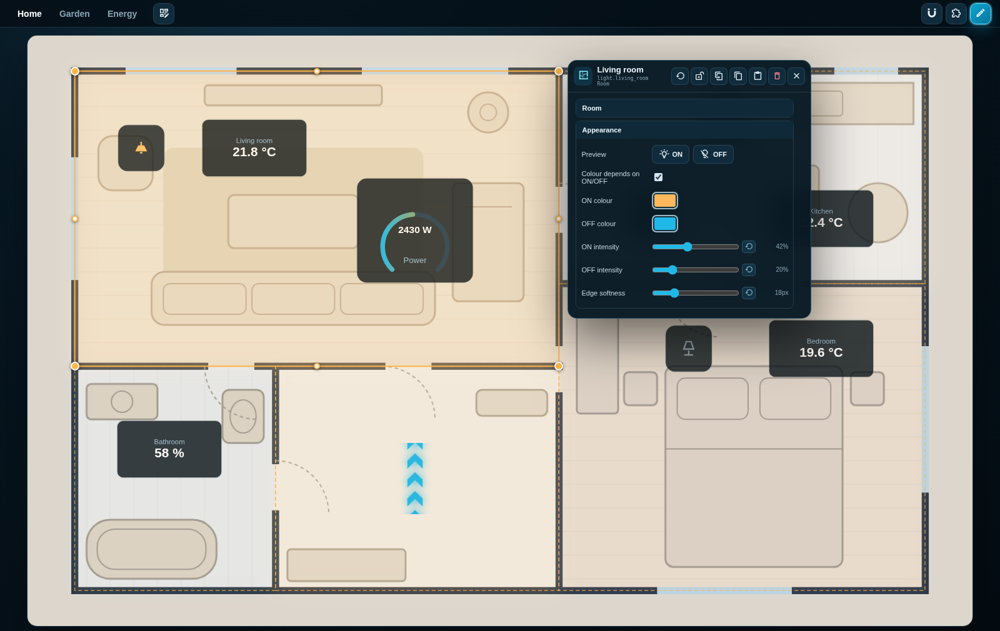
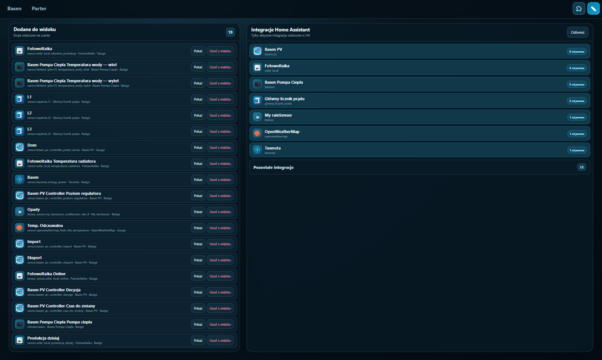
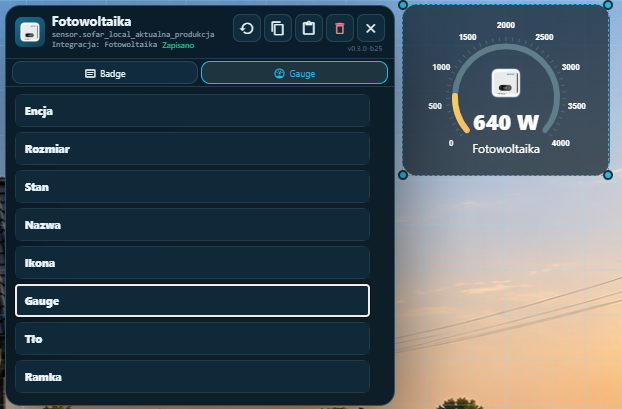

# HA Views

Create polished, interactive visual dashboards for Home Assistant on any image or solid-colour background. One saved layout stays responsive across desktop, laptop and mobile.

## What's new in 0.6.0

- **Thermostat**: a full thermostat for `climate` and `water_heater` built from movable parts: dial with glow, target and current temperature, working state, −/+ and mode buttons, presets, optional confirmation, and extra entities such as boiler pressure.
- **Label and Text**: a Label shows the icon, name and state of an entity, with ready-made styles. Text is any caption or button, for example to switch views.
- **Ungroup and resize**: move every part of a Label or Thermostat on its own, resize with corner handles, and snap inside a group with its own grid.
- **Smarter snapping**: a square S/M/L grid and thin, exact guide lines for edges, centres, spacing and size.
- **Better editing on phone and desktop**: a docked edit panel on desktop, the tapped element centred above the panel, zoom below 100%, and protection against accidental drags.
- **Viewer mode** users can now use the toggles and thermostats an admin placed on a view.

The complete list is in the [Changelog](ha_views/CHANGELOG.md).

## Highlights

- **Independent dashboards** — create, duplicate, rename, reorder and delete views; choose the view that opens by default.
- **Complete background workflow** — use a solid colour or upload PNG, JPG and WebP images; select, download and delete saved backgrounds.
- **Rooms and Flow** — glowing room outlines driven by lights, and animated arrows driven by entity values.
- **Day and night backgrounds** — automatic crossfade by `sun.sun` or any entity, with separate brightness.
- **Four marker types** — Badge, Gauge, Icon and Horseshoe — each independently positioned, rotated and styled, with optional value-based colours.
- **Rich Badge and Icon styling** — labels, values and custom ON/OFF text; Home Assistant icons, custom MDI icons or integration logos; separate fill, outline, colour and opacity settings, including ON/OFF variants.
- **Background and border effects** — solid colour or central, corner, wall and ambient light gradients with position, spread and fill controls; adjustable borders, thickness, opacity and shapes.
- **Advanced Gauge and Horseshoe** — configurable range, track and value colours, gradient, arc geometry, scale, ticks, tick labels, value, name and percentage.
- **Fast visual editing** — drag markers, Flows and rooms with alignment guides, resize with corner handles, lock geometry, keep elements inside the background, align and rotate, use S/M/L grid presets and scale marker content independently.
- **Safe styling workflow** — reset individual sliders, restore defaults, copy/paste complete styles, and test an ON/OFF state without controlling the entity.
- **Home Assistant actions** — open native More Info or toggle supported entities directly from a marker in view mode.
- **Integration browser** — shows visible Home Assistant integrations only, with brand icons, used-marker counts and search by entity name or `entity_id`.
- **Responsive controls** — desktop mouse-wheel zoom plus mobile pinch, pan, swipe between views (Slide / Cube) and editing that preserves exact marker positions.
- **Viewer mode** — Home Assistant users without admin rights can view dashboards, read-only.
- **Built for Home Assistant** — layouts and styling are saved in Home Assistant; HA Views does not publish your entities, integrations or backgrounds.

## Status

Stable release. As with every Home Assistant add-on update, make a backup before updating.

See [Documentation](ha_views/DOCS.md) and [Changelog](ha_views/CHANGELOG.md).

---

# Polski

Twórz dopracowane, interaktywne wizualne pulpity Home Assistanta na dowolnym obrazie lub jednolitym kolorze tła. Jeden zapisany układ działa responsywnie na komputerze, laptopie i telefonie.

## Co nowego w 0.6.0

- **Termostat**: pełny termostat dla `climate` i `water_heater`, złożony z przesuwalnych części: tarcza z poświatą, temperatura ustawiona i aktualna, stan pracy, przyciski −/+ i trybów, presety, opcjonalne potwierdzenie i dodatkowe encje, np. ciśnienie w kotle.
- **Etykieta i Tekst**: etykieta pokazuje ikonę, nazwę i stan encji, z gotowymi stylami. Tekst to dowolny napis lub przycisk, np. do przełączania widoków.
- **Rozgrupowanie i zmiana rozmiaru**: każdą część etykiety lub termostatu przesuwasz osobno, zmieniasz rozmiar kropkami w rogach, a wewnątrz grupy działa przyciąganie z własną siatką.
- **Lepsze przyciąganie**: kwadratowa siatka S/M/L i cienkie, dokładne linie pomocnicze dla krawędzi, środków, odstępów i rozmiaru.
- **Wygodniejsza edycja na telefonie i komputerze**: zadokowany panel na komputerze, dotknięty element centrowany nad panelem, zoom poniżej 100% i ochrona przed przypadkowym przesunięciem.
- **Tryb podglądu**: użytkownicy bez uprawnień administratora mogą używać przełączników i termostatów, które administrator umieścił na widoku.

Pełna lista zmian jest w [changelogu](ha_views/CHANGELOG.md).

## Najważniejsze funkcje

- **Niezależne pulpity** — twórz, duplikuj, zmieniaj nazwę, kolejność i usuwaj widoki; wybierz widok uruchamiany domyślnie.
- **Pełna obsługa tła** — jednolity kolor albo pliki PNG, JPG i WebP; wybór, pobieranie i usuwanie zapisanych teł.
- **Pomieszczenia i Flow** — świecące obrysy pokoi sterowane światłami oraz animowane strzałki sterowane wartościami encji.
- **Tło dzienne i nocne** — automatyczne przenikanie wg `sun.sun` lub dowolnej encji, z osobną jasnością.
- **Cztery typy markerów** — Badge, Gauge, Ikona i Podkowa — każdy niezależnie pozycjonowany, obracany i stylowany, z opcjonalnymi kolorami wg wartości.
- **Rozbudowany Badge i Ikona** — nazwa, stan oraz własne teksty ON/OFF; ikony Home Assistant, własne MDI lub logo integracji; osobne wypełnienie, obrys, kolor i przezroczystość, także dla ON/OFF.
- **Efekty tła i ramki** — jednolity kolor albo gradienty: centralny, róg, od ściany i ambient, z pozycją, rozproszeniem i wypełnieniem; regulowane ramki, grubość, przezroczystość i kształty.
- **Zaawansowane Gauge i Podkowa** — zakres, kolory toru i wartości, gradient, geometria łuku, skala, podziałki, liczby skali, stan, nazwa i procent.
- **Szybka edycja wizualna** — przeciąganie markerów, Flow i pomieszczeń z liniami pomocniczymi, zmiana rozmiaru uchwytami rogów, blokada geometrii, granice tła, wyrównanie i obrót, siatka S/M/L i niezależna skala zawartości markerów.
- **Bezpieczny styl** — reset pojedynczych suwaków, przywracanie domyślnych, kopiowanie/wklejanie pełnego stylu oraz test stanu ON/OFF bez sterowania encją.
- **Akcje Home Assistant** — natywne More Info albo bezpośrednie przełączanie obsługiwanych encji po kliknięciu markera w widoku.
- **Przeglądarka integracji** — tylko widoczne integracje Home Assistant, ikony marek, liczba użytych markerów i wyszukiwanie po nazwie lub `entity_id`.
- **Responsywne sterowanie** — zoom rolką na komputerze oraz pinch, pan, przełączanie widoków palcem (Przesunięcie / Kostka) i edycja na telefonie z zachowaniem dokładnych pozycji markerów.
- **Tryb podglądu** — użytkownicy Home Assistant bez uprawnień administratora mogą oglądać pulpity, bez możliwości edycji.
- **Dane pozostają u Ciebie** — układy i style są zapisywane w Home Assistant; HA Views nie publikuje Twoich encji, integracji ani teł.

## Status

Wersja stabilna. Jak przy każdej aktualizacji dodatku Home Assistant, przed aktualizacją wykonaj backup.

Pełna [dokumentacja](ha_views/DOCS.md) i [changelog](ha_views/CHANGELOG.md).
